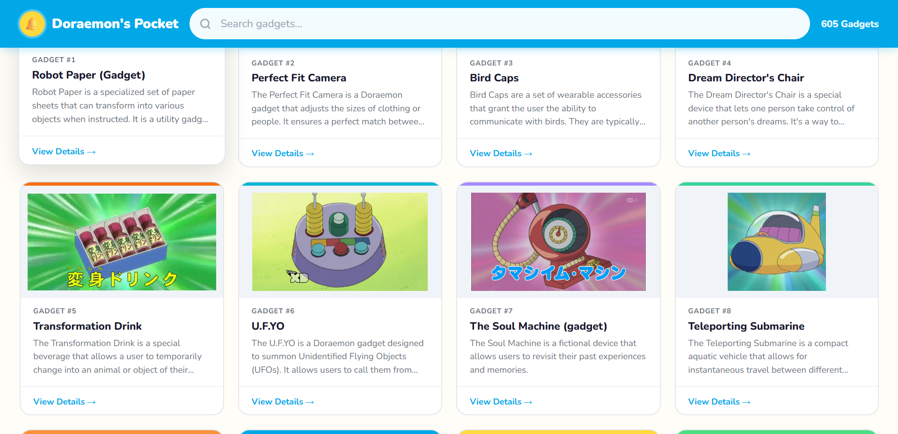
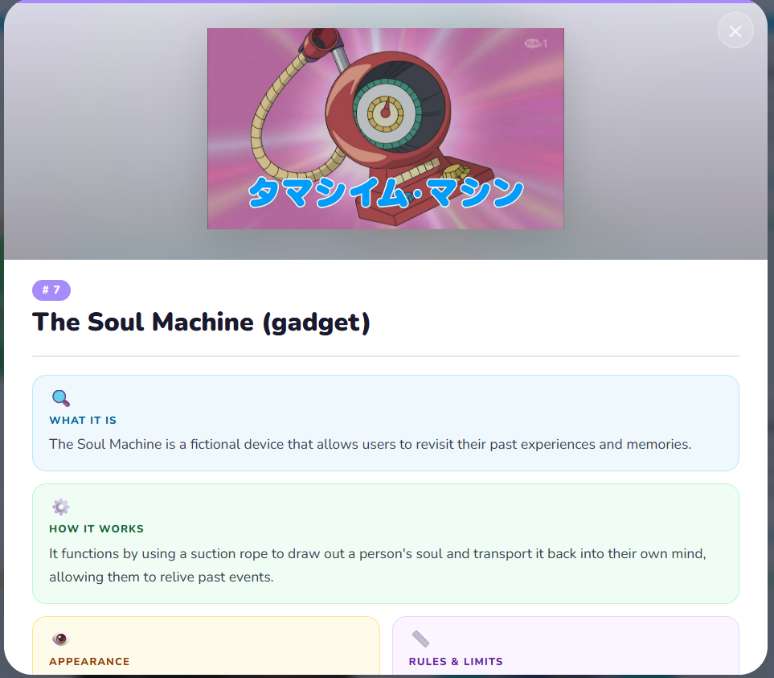

<div align="center">


# 🔔 Doraemon's Pocket

### A searchable encyclopedia of every gadget from Doraemon's 4D Pocket

[](https://t4sn33m-s4h4t.github.io/-Doraemon-s-Pocket-/)
[](https://github.com/t4sn33m-s4h4t)
[](#)
[](#)

</div>

---

## 📸 Preview

> **Home — Card Grid**



> **Gadget Detail Modal**



---

## ✨ What is this?

**Doraemon's Pocket** is a fan-made, fully client-side encyclopedia that catalogs **979+ gadgets** from the beloved Doraemon universe. Every gadget gets its own card and a rich detail view — covering what it is, how it works, its appearance, real-life equivalents, known misuses, and fun facts.

No backend. No framework. No build step. Just two files.

---

## 🚀 Features

| Feature | Details |
|---|---|
| 🔍 **Live Search** | Instantly filter gadgets by name or description as you type |
| 🃏 **Card Grid** | Color-coded cards, 4-column responsive layout, shimmer loading skeletons |
| 🪟 **Detail Modal** | Hero image with blurred background, 2-column info layout, emoji-tagged sections |
| 📄 **Pagination** | Load 24 gadgets at a time — smooth and fast even with 979+ entries |
| 🖼️ **Smart Images** | Auto-fallback via image proxy if the primary URL fails; graceful "No Image" badge |
| 📱 **Fully Responsive** | 4 col → 3 col → 2 col across desktop, tablet, and mobile |
| ⚡ **Zero Dependencies** | Pure HTML + CSS + Vanilla JS. No npm, no build, no frameworks |

---

## 📂 Project Structure

```
doraemon-pocket/
├── index.html                 # Entire app — HTML, CSS, and JS in one file
└── doraemon_processed.json    # Gadget dataset (979+ entries)
```

---

## 🗂️ Data Format

Each gadget in `doraemon_processed.json` looks like this:

```json
{
  "id": 315,
  "name": "Universal Stage Set",
  "image_url": "https://static.wikia.nocookie.net/doraemon/images/...",
  "what_it_is": "A versatile gadget that allows users to create various scenes...",
  "its_appearance": "A compact design, possibly resembling a small box...",
  "how_it_works": "Uses advanced technology to generate realistic environments...",
  "rules_and_limits": "May have limitations on complexity or scale...",
  "real_life_equivalent": "A high-tech theater or a virtual reality platform...",
  "the_big_mistake": "Can be misused if users become too immersed...",
  "fun_fact": "Showcases Doraemon's ability to provide innovative solutions..."
}
```

All fields except `id` and `name` are optional — missing or empty fields are silently skipped in the detail view.

---

## 🖥️ Running Locally

> **Why a local server?** Browsers block `fetch()` calls from `file://` URLs for security. A local server (one command) fixes this instantly.

**Step 1 — Clone the repo**
```bash
git clone https://github.com/t4sn33m-s4h4t/-Doraemon-s-Pocket-.git
cd -Doraemon-s-Pocket-
```

**Step 2 — Start a local server**

Using Python (built-in, no install):
```bash
python -m http.server 8000
```

Or Node.js:
```bash
npx serve .
```

**Step 3 — Open in browser**
```
http://localhost:8000
```

The site loads `doraemon_processed.json` automatically from the same folder.

---

## 🌐 Deploying to GitHub Pages

1. Push both files to a GitHub repository
2. Go to **Settings → Pages**
3. Set source: **Deploy from branch → `main` → `/ (root)`**
4. Click **Save**

Your site goes live at:
```
https://<your-username>.github.io/<repo-name>/
```

> Make sure `doraemon_processed.json` is committed alongside `index.html` — GitHub Pages serves static files directly.

---

## 🎨 Design System

| Token | Value | Usage |
|---|---|---|
| Primary Blue | `#00A8E8` | Header, buttons, accents |
| Sunshine Yellow | `#FFD93D` | Logo bell, highlights |
| Coral Red | `#FF6B6B` | Card accents |
| Soft Purple | `#C084FC` | Card accents |
| Mint Green | `#4ADE80` | Card accents |
| Background | `#FFFDF7` | Warm off-white page bg |
| Font | **Nunito** | Rounded, playful, highly legible |

Card accent colors cycle through 10 colors based on each gadget's ID — so every card has a consistent identity across sessions.

---

## ⚙️ Customization

**Change how many gadgets load per page** (default: 24):
```js
// Inside index.html, find:
var PAGE_SIZE = 24;
// Change to any number you like
```

**Use a different JSON filename**:
```js
// Find this line:
fetch('doraemon_processed.json')
// Replace with your filename
```

**Adjust grid columns** (default: 4 on desktop):
```css
/* Find in the CSS: */
.grid { grid-template-columns: repeat(4, 1fr); }
/* Change 4 to 3 or 5 as desired */
```

---

## 📜 Disclaimer

This is a fan project made for educational and personal use. Doraemon and all related characters, gadgets, and intellectual property belong to **Fujiko F. Fujio** and **Shogakukan**. No copyright infringement intended.

---

<div align="center">

Made with 💙 by [t4sn33m-s4h4t](https://github.com/t4sn33m-s4h4t)

⭐ Star this repo if you find it useful!

</div>
